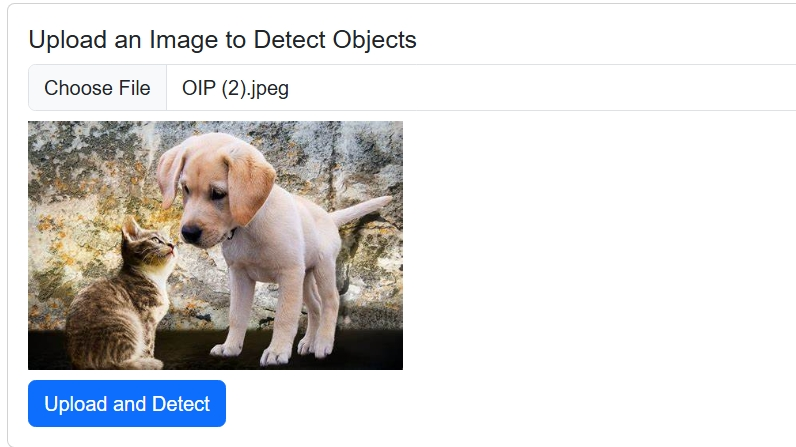
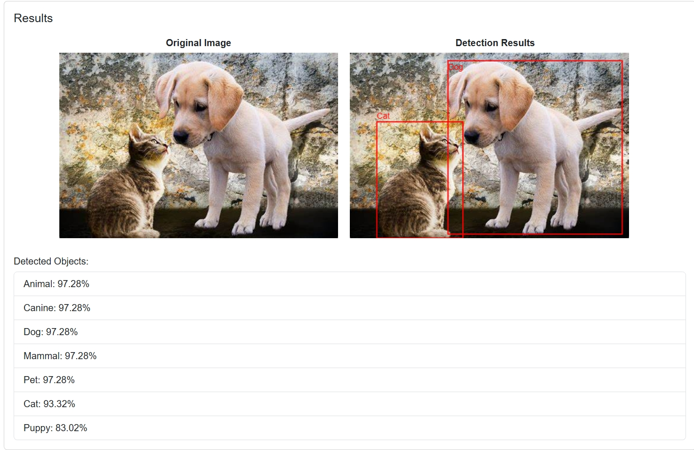
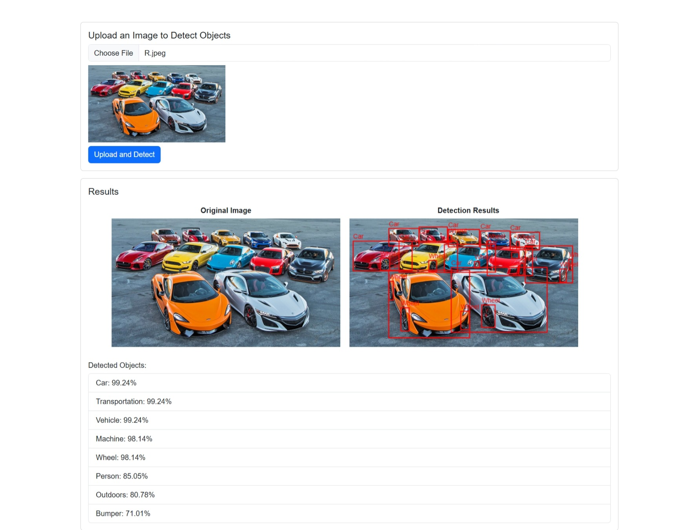

# 🧠 AWS Rekognition Object Detection 🔍

A web-based application that lets users upload images and detect objects using **AWS Rekognition**. Images are uploaded to an **S3 bucket**, processed via an **AWS Lambda** function exposed through **API Gateway**, and detected objects are displayed with **bounding boxes** and **confidence scores**.

---

## 🌐 Live Preview

### 📤 Upload Interface  


### 🎯 Detection Results  


### 🖼️ Full View  


---

## ✨ Features

- 📁 Upload images through a web interface
- ☁️ Store images in an AWS S3 bucket
- 🤖 Detect objects with AWS Rekognition
- 📊 Display object names and confidence scores
- 🖍️ Draw bounding boxes on detected items

---

## ⚙️ Prerequisites

Before running the project, ensure you have:

- ✅ An AWS account with access to **S3** and **Rekognition**
- ✅ An **S3 bucket** to store uploaded images
- ✅ A **Lambda function** and **API Gateway** set up for object detection
- ✅ AWS credentials (stored securely in a file — see below 👇)

---

## 🚀 Getting Started

### 1. 📦 Clone the repository
```bash
git clone https://github.com/NadeeshaAbey/AWS-Rekognition-object-detection.git
cd AWS-Rekognition-object-detection
```
### 2. 🔐 Configure AWS Credentials

Create a `config.js` file in the project root (⚠️ **do NOT commit this file**):

```js
const AWS_ACCESS_KEY_ID = 'YOUR_ACCESS_KEY_ID';
const AWS_SECRET_ACCESS_KEY = 'YOUR_SECRET_ACCESS_KEY';
const AWS_REGION = 'YOUR_AWS_REGION';
const S3_BUCKET = 'YOUR_S3_BUCKET_NAME';
const API_URL = 'YOUR_API_GATEWAY_URL';
```

### 3. 🧪 Open the App

Open `index.html` in your web browser.

---

### 4. 🖼️ Upload an Image

Use the provided file input form to upload an image.

---

### 5. 📊 View Detection Results

- 🖼️ The uploaded image will be displayed.
- 🎯 Detected objects and their confidence scores will be shown.
- 📦 Bounding boxes will be drawn around detected items.

---

## 🛠️ Notes

- ❌ **Do not commit your `config.js` file or AWS credentials** to version control.
- ⚙️ Ensure your **S3 bucket**, **API Gateway**, and **Lambda function** are properly configured with **CORS** and **IAM permissions**.

---

## 📄 License

This project is for **educational purposes only**.  
Feel free to **fork, learn, and experiment**! 🎓
